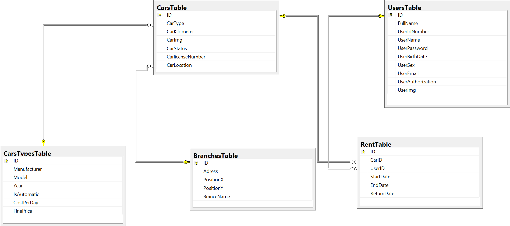

# .Net Final Project-Car rental server & client side

* The task of the project is to create a functinal car rental application that contains the server and the client side.
* The  DB used in this project is a mysql microsoft DB.
* The server is written in C# with WebApi tecnology.
* The client side was writen in Angular 5.

***
## Data Base
**The DB contains 5 tables:**
 1. **Users:** contain all the users inforamtion.
 2. **Car Type:** contain all the car type information.
 3. **Cars**: contain all the car information and and reference to each car type.
 4. **Rents table:** contain all the rents information and reference to each User and car.
 5. Branches table-contain all the branch inforamtiom. 
 
 
 
 
***

## Server side
* The server is dividd into to 4 project using th N-tier model.

### BOL
* Contains 5 class classes. 
1. User class.
2. Car Type class.
3. car class.
4. Branch class
5. Rent class.

### BLL
* Contains All the C.R.U.D(create, read, update and delete) function.
* for each class in the Bol there is a crud manager in the Bll

### DAL
* The Dal contains the entity framwork to the DB

### UIL
* The UIL is a Wep Api server that allow the client to communicate with the DB.
*  The UIL contains 5 controllers that can be reach by http reqwests from the client side.
* every time that a client is sending a http reqwest the UIL recive the reqwest and activate the right function in the BLL.
* In order to maintain security in the DB each http respons function in each controller has it own Autoraiton that is determin using the
 BasicAuthFilter class in the filter folder. that way only spsfific users can modify the data in the DB.
 
***
## Client side
* The clinet side is Single-Page Application wirrten in Angular 5.
* The app aloows the user to sent a variity of http reqwests to the server, view data from the Db and modify it(acording to his level of Autorautins)
* All the http reqwests are located in five servicses.and acording to the user activaiton in the website the reqwests are activates.

***
## Insatalition the app
* In order to activate the app in your own personal pc foolw the nect few steps:
1. Open a new Query in your mysql server and copy all the data from the sqlscript file located in the reposotory.
2. After the DB is set, take all the project in the server side folders and create your oun local server.
3. dowon loud all the project in the server dife folder and start your oun local server.
4. run the server and copy the URL in the server page opened.
5. down loud all the angular project from the clirent side folder.
6. in your project click -npn-install in order to set your angular project.
7.After all the app is running(both server and client side).copy the server Url to the foolwing places:
 

